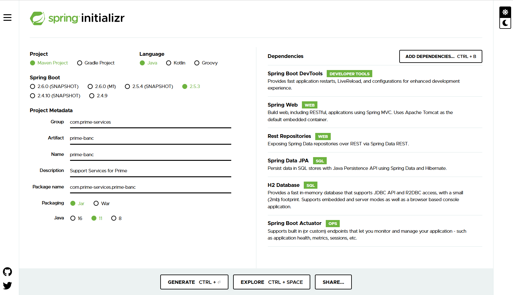
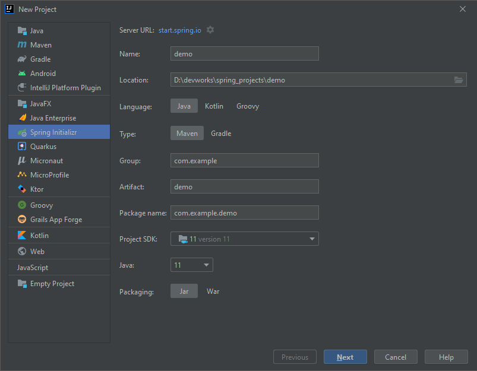
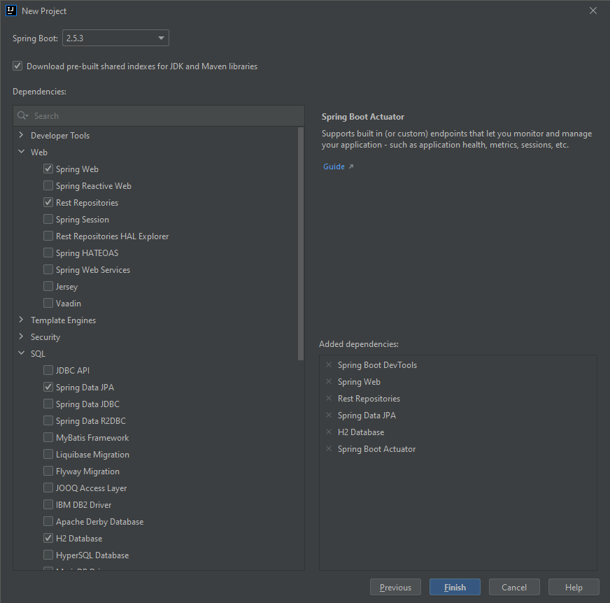

# prime-springboot-java-ms
Spring boot app that provides services for prime, These services are build using java. The below-mentioned service are active as of now.

- Customer Registration (/api/v1/register - Post)
- Customer Authentication (/api/v1/authenticate - Post)
- Products (Stocks, Financial Products)
  - Buying Products (/api/v1/product/buy - Post)
  - Selling Products (/api/v1/product/sell - Post)
- IPO
  - Register IPO (/api/v1/ipo/register - Post)
  - Fetch Customer Initiated IPO (/api/v1/ipo/{userName} - Get)
- Mutual Funds
  - Register Mutual Fund (/api/v1/mutual-fund/register - Post)
  - Customer Owned Mutual Funds (/api/v1/mutual-fund/{userName} - Get)

This is a maven project, Entities, Repositories, Enums, services and controller files are present in corresponding folder.

## Initial Project Set-up
- Navigate to start.spring.io and choose options as displayed in the below screen shot.



- if you are creating using an IDE intellij screen-shot reference provided below:
- In File option click new >> project below screen will appear.

- Then choose dependencies on next screen


> Once after project creation we can start application by running the application as springboot application.

After application starting if we load the url http://localhost:8080, you will see a json response with link to profile
as we added rest repositories dependency.

> The capabilities that the dependencies will provide to your project are explained in spring initializer website.

Our main aim with this project is to perform crud operations on a table with help of Rest.

## Lets define a table
To make springboot understand a schema of a table we have to create an entity class.
- Entity class is a simple plain old java object (POJO) which includes few annotations.
- Under the path src >> main >> java >> com.primebanc.primespringbootjavams >> entities you will find a MutualFund.java class
- We annotate it with @Entity from javax persistence, to make springboot understand that it is an entity class.
- @Table annotation is used to bind this class with the name of the table that is passed as name parameter to this annotation.
- As every table contains a primary key, we need to identify the primary key in customer table with @Id annotation.
- id field is annotated in the reference.
- Now we have to bind it with the column name in the table so @Column annotation followed by the exact field name in table is provided.
- We can autogenerate the ID field hence we use the annotation @GeneratedValue(strategy = GenerationType.IDENTITY).
- For the remaining fields we can annotate them with @Column alone to bind them to corresponding table fields.
- We will also create constructors will all parameters and no parameters.

Example screenshot provided below:
```kotlin
package com.primebanc.primespringbootjavams.entities;

import com.primebanc.primespringbootjavams.enums.FundType;
import com.primebanc.primespringbootjavams.enums.MutualFundPaymentMode;
import com.primebanc.primespringbootjavams.enums.MutualFundRiskLevel;

import javax.persistence.Column;
import javax.persistence.Entity;
import javax.persistence.GeneratedValue;
import javax.persistence.GenerationType;
import javax.persistence.Id;
import javax.persistence.Table;
import java.time.LocalDate;

@Entity
@Table(name = "Mutual_Fund")
public class MutualFund {
    @Id
    @Column(name = "Id")
    @GeneratedValue(strategy = GenerationType.IDENTITY)
    private Long id;
    @Column(name = "User_Name")
    private String userName;
    @Column(name = "Fund_Type")
    private FundType fundType;
    @Column(name = "Risk_Level")
    private MutualFundRiskLevel riskLevel;
    @Column(name = "Tenure")
    private int tenure;
    @Column(name = "Investment_Amount")
    private double investmentAmount;
    @Column(name = "Payment_Mode")
    private MutualFundPaymentMode paymentMode;
    @Column(name = "Maturity_Amount")
    private double maturityAmount;
    @Column(name = "Registration_Date")
    private LocalDate registrationDate;

    public MutualFund() {
    }

    public MutualFund(Long id, String userName, FundType fundType, MutualFundRiskLevel riskLevel, int tenure, double investmentAmount, MutualFundPaymentMode paymentMode, double maturityAmount, LocalDate registrationDate) {
        this.id = id;
        this.userName = userName;
        this.fundType = fundType;
        this.riskLevel = riskLevel;
        this.tenure = tenure;
        this.investmentAmount = investmentAmount;
        this.paymentMode = paymentMode;
        this.maturityAmount = maturityAmount;
        this.registrationDate = registrationDate;
    }

    public Long getId() {
        return id;
    }

    public void setId(Long id) {
        this.id = id;
    }

    public String getUserName() {
        return userName;
    }

    public void setUserName(String userName) {
        this.userName = userName;
    }

    public FundType getFundType() {
        return fundType;
    }

    public void setFundType(FundType fundType) {
        this.fundType = fundType;
    }

    public MutualFundRiskLevel getRiskLevel() {
        return riskLevel;
    }

    public void setRiskLevel(MutualFundRiskLevel riskLevel) {
        this.riskLevel = riskLevel;
    }

    public int getTenure() {
        return tenure;
    }

    public void setTenure(int tenure) {
        this.tenure = tenure;
    }

    public double getInvestmentAmount() {
        return investmentAmount;
    }

    public void setInvestmentAmount(double investmentAmount) {
        this.investmentAmount = investmentAmount;
    }

    public MutualFundPaymentMode getPaymentMode() {
        return paymentMode;
    }

    public void setPaymentMode(MutualFundPaymentMode paymentMode) {
        this.paymentMode = paymentMode;
    }

    public double getMaturityAmount() {
        return maturityAmount;
    }

    public void setMaturityAmount(double maturityAmount) {
        this.maturityAmount = maturityAmount;
    }

    public LocalDate getRegistrationDate() {
        return registrationDate;
    }

    public void setRegistrationDate(LocalDate registrationDate) {
        this.registrationDate = registrationDate;
    }
}
```

## Creating Repository interface
- As we have defined a table, now we can create the functions to perform create, read, update, delete operations.
- Instead of writing this code we can extend CRUDRepository or JPARepository
- These classes have predefined functions to perform all these operations.
- We will also annotate repository class with @Repository Annotation
 
Information about this repository functions need to be added #TODO

Example Repository class mentioned below:

```kotlin
package com.primebanc.primespringbootjavams.repository;

import com.primebanc.primespringbootjavams.entities.MutualFund;
import org.springframework.data.jpa.repository.JpaRepository;
import org.springframework.stereotype.Repository;

import java.util.List;

@Repository
public interface MutualFundRepository extends JpaRepository<MutualFund, Long> {
    List<MutualFund> findMutualFundByUserName(String userName);
}
```

# Service Creation
- To expose this operations via network we need to serialize them.
- We use @Service annotation to do that.
- In the service class itself we will include business logic as well.

```kotlin
package com.primebanc.primespringbootjavams.service;

import com.primebanc.primespringbootjavams.entities.MutualFund;
import com.primebanc.primespringbootjavams.model.CommonResponse;
import com.primebanc.primespringbootjavams.repository.MutualFundRepository;
import org.springframework.stereotype.Service;

import java.time.LocalDate;
import java.util.List;

@Service
public class MutualFundService {
  private MutualFundRepository mutualFundRepository;

  public MutualFundService(MutualFundRepository mutualFundRepository) {
    this.mutualFundRepository = mutualFundRepository;
  }

  public CommonResponse registerMutualFund(MutualFund mutualFund){
    mutualFund.setRegistrationDate(LocalDate.now());
    mutualFundRepository.save(mutualFund);
    return new CommonResponse("ADDED","Mutual Fund registration successful.");
  }

  public List<MutualFund> fetchMutualFundsOwnedByUser(String userName){
    return mutualFundRepository.findMutualFundByUserName(userName);
  }
}
```

# Significance of Controller 
- Even if we create a service class we cannot expose an operation as there is no url binding.
- With help of a controller class we can achieve it.
- We create a class which accepts service as constructor parameter.
- @Controller or @Restcontroller annotations can be used can be used.

Example mentioned below:
```kotlin
package com.primebanc.primespringbootjavams.controller;

import com.primebanc.primespringbootjavams.entities.MutualFund;
import com.primebanc.primespringbootjavams.model.CommonResponse;
import com.primebanc.primespringbootjavams.service.MutualFundService;
import org.springframework.web.bind.annotation.CrossOrigin;
import org.springframework.web.bind.annotation.PathVariable;
import org.springframework.web.bind.annotation.RequestBody;
import org.springframework.web.bind.annotation.RequestMapping;
import org.springframework.web.bind.annotation.RequestMethod;
import org.springframework.web.bind.annotation.RestController;

import java.util.List;

@RestController
@CrossOrigin
@RequestMapping(value = "/api/v1/mutual-fund")
public class MutualFundController {
    private MutualFundService mutualFundService;

    public MutualFundController(MutualFundService mutualFundService) {
        this.mutualFundService = mutualFundService;
    }

    @RequestMapping(value = "/register",method = RequestMethod.POST)
    public CommonResponse registerMutualFund(@RequestBody MutualFund mutualFund){
        return mutualFundService.registerMutualFund(mutualFund);
    }

    @RequestMapping(value = "/{userName}",method = RequestMethod.GET)
    public List<MutualFund> fetchUserMutualFunds(@PathVariable String userName){
        return mutualFundService.fetchMutualFundsOwnedByUser(userName);
    }
}
```

> To test these services we can use soapui or postman the postman collection can be found in postman folder in code section.

> Import postman collection and test the app once it is started. 

Binding to persistence database #todo

